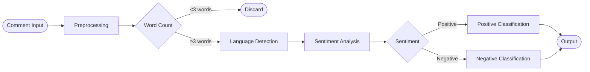
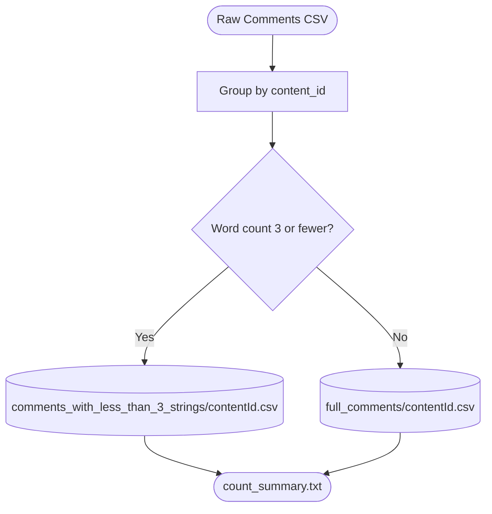
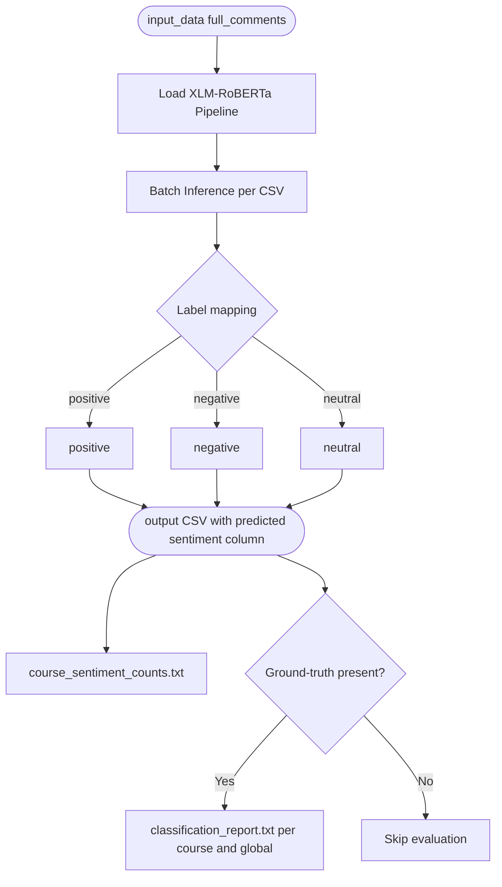
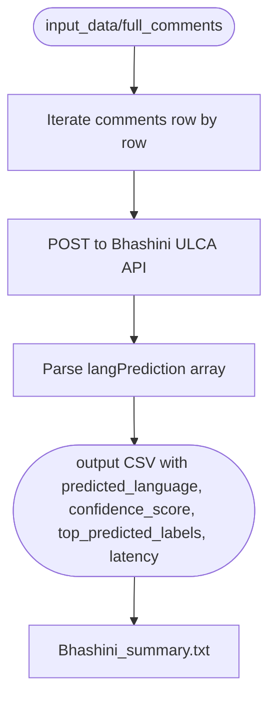
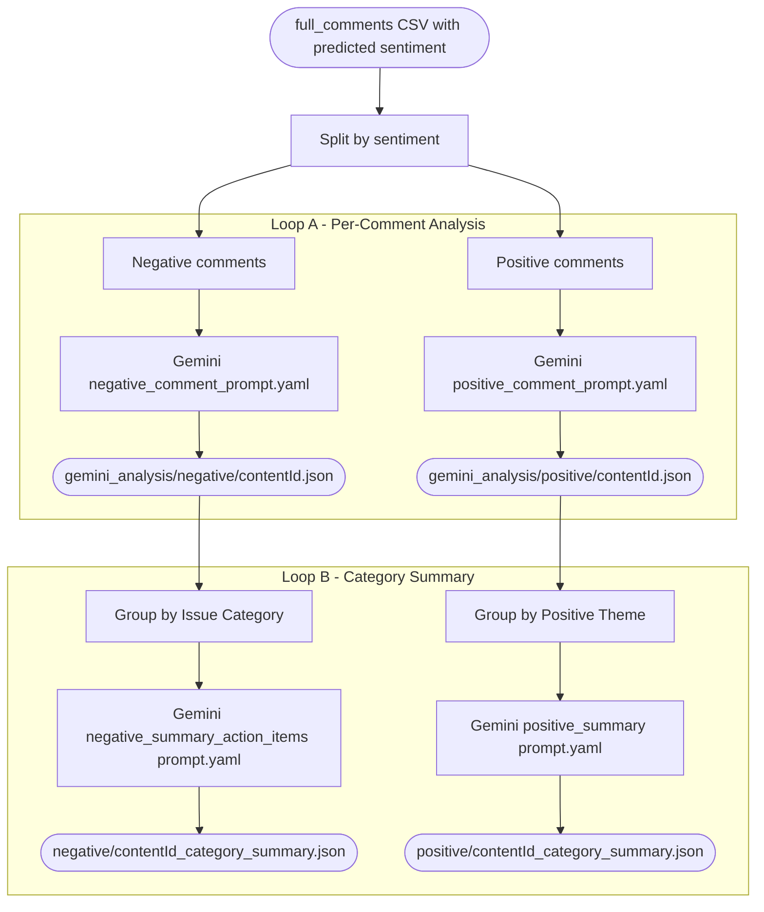
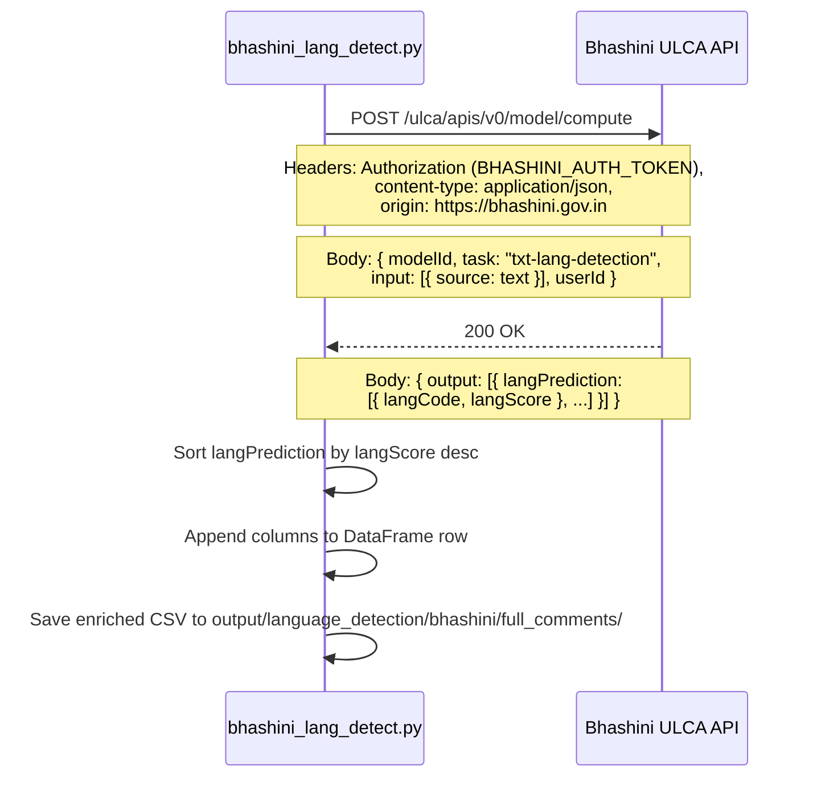
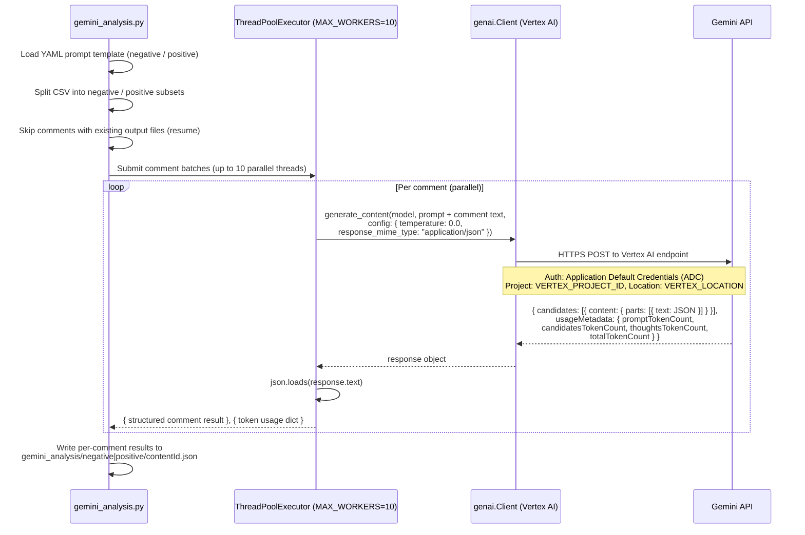
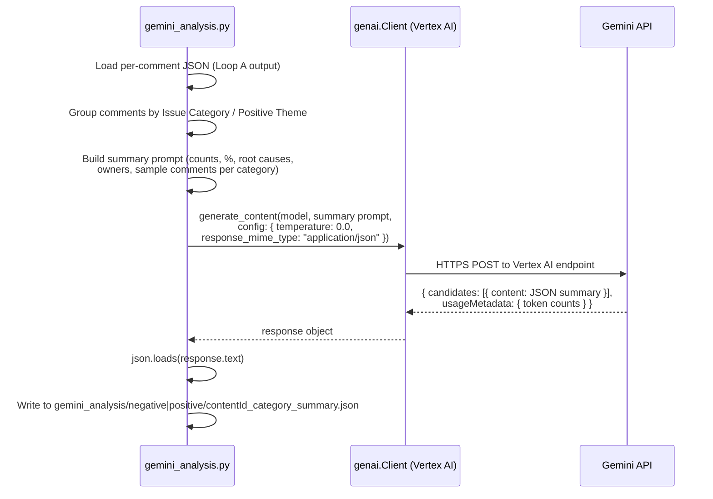

# [HLD] — Sentiment Analysis Pipeline

## 1. Overview

This document outlines a high-level design for the iGOT Sentiment Analysis Pipeline, which processes learner comments on course content to produce structured, actionable insights. The system classifies comment sentiment, detects the language of each comment, and uses Google Gemini on Vertex AI to perform deep per-comment categorisation and course-level summarisation with prioritised action items.

---

## 2. Architecture

### 2.1 System Components

1. **Data Preparation Script** — Reads raw learner comments, groups them by course, normalises dates, and splits comments into short (≤ 3 words) and full-length buckets.

2. **HuggingFace Transformers (XLM-RoBERTa)** — A multilingual transformer model used for zero-shot sentiment classification of learner comments into positive, negative, or neutral labels.

3. **Bhashini ULCA API** — A government language detection service that identifies the language of each comment, with graceful fallbacks for blank input and unknown language codes.

4. **Google Vertex AI (Gemini)** — An LLM-based analysis layer that performs two sequential passes over sentiment-tagged comments:
   - a. **gemini_analysis.py** — Per-comment analysis to extract structured issue or positive theme metadata.
   - b. **gemini_analysis.py (Loop B)** — Category-level summary generation with root causes, owners, priorities, and action items.

### 2.2 High-Level Flow

The pipeline is divided into four stages:

1. Data Preparation Script
2. Sentiment Analysis Script
3. Language Detection Script
4. Gemini Analysis Script

**Data Preparation Script:**

1. **Source CSV** — Raw learner comments with `content_id`, `content_name`, `comment`, and `comment_date` columns.
2. **Grouping** — Comments are grouped by `content_id` so one output file is produced per course.
3. **Date Normalisation** — `comment_date` is cleaned to `YYYY-MM-DD` format.
4. **Short Comments** — Comments with 3 words or fewer are archived in `comments_with_less_than_3_strings` and excluded from further analysis.
5. **Full Comments** — Comments with more than 3 words are written to `full_comments` and fed into subsequent stages.
6. **Count Summary** — A `count_summary.txt` is written to each output directory with per-file row counts.

---

**Sentiment Analysis Script:**

1. **Model Loading** — The `cardiffnlp/twitter-xlm-roberta-base-sentiment-multilingual` pipeline is loaded from HuggingFace with `truncation=True` and `max_length=512`.
2. **Batch Inference** — Each CSV in `input_data` is processed.
3. **Label Mapping** — Model output labels are normalised to lowercase `positive`, `negative`, or `neutral`.
4. **Output** — Each CSV is saved to `output` with a new `predicted sentiment` column appended.
5. **Per-course Counts** — Sentiment distribution per course is written to `course_sentiment_counts.txt`.
6. **Evaluation** — When an `actual sentiment` ground-truth column is present, accuracy, per-class recall, and a confusion matrix are computed and saved.

---

**Language Detection Script:**

1. **Scoped Input** — Only `full_comments` CSVs are processed; short comments are excluded.
2. **Blank Handling** — Empty or NaN text defaults to `lang=en` with score `0.0` and `UNKNOWN` labels without making an API call.
3. **API Call** — Each comment is sent to the Bhashini ULCA `txt-lang-detection` model.
4. **Output Columns** — `predicted_language`, `confidence_score`, `top_predicted_labels`, and `latency` are appended to the CSV.
5. **Benchmark Summary** — `Bhashini_summary.txt` captures per-file sample counts, average latency, overall throughput, and language distribution.

---

**Gemini Analysis Script:**

1. **Sentiment Split** — The sentiment-tagged CSV is split into negative and positive subsets; neutral comments are excluded from Gemini analysis.
2. **Loop A — Per-Comment Analysis** — Each comment is sent to Gemini with a structured prompt. Up to 10 comments are processed in parallel via `ThreadPoolExecutor`. Already-analysed comments from previous runs are skipped automatically (resume support).
3. **Loop B — Category Summary** — Per-comment JSON outputs are grouped by Issue Category (negative) or Positive Theme (positive). A consolidated prompt is built containing category counts, percentages, root causes, owners, and sample comments, then sent to Gemini to produce a course-level summary with prioritised action items.
4. **Error Handling** — Failed JSON parses are logged with raw output; the pipeline continues to the next file.

---

## 3. Module Design

### 3.1 Data Preparation Module (`clean_and_date_format.py`)

- Reads the source CSV and groups rows by `content_id`.
- Splits comments by word count into two output directories.
- Normalises `comment_date` to `YYYY-MM-DD`.
- Writes per-directory `count_summary.txt` files.

### 3.2 Sentiment Analysis Module (`sentiment_analysis.py`)

- Loads the `cardiffnlp/twitter-xlm-roberta-base-sentiment-multilingual` pipeline from HuggingFace.
- Runs batch inference across all CSVs under `input_data` recursively.
- Appends `predicted sentiment` column and saves updated CSVs to `output`.
- Generates `course_sentiment_counts.txt` and optional per-course and global classification reports.

| Output File | Description |
|---|---|
| `output/contentId.csv` | CSV with appended `predicted sentiment` |
| `output/course_sentiment_counts.txt` | Positive / neutral / negative counts per course |
| `output/contentId_classification_report.txt` | Per-course precision, recall, F1 (if ground-truth present) |
| `output/classification_report.txt` | Aggregated global metrics and confusion matrix |

### 3.3 Language Detection Module (`bhashini_lang_detect.py`)

- Reads every CSV under `input_data/full_comments/`.
- Calls the Bhashini ULCA `txt-lang-detection` API per comment with 30-second timeout.
- Applies fallback and remapping rules for blank, unknown, and error cases.
- Saves results to `output/language_detection/bhashini/full_comments/`.
- Writes a benchmark summary to `Bhashini_summary.txt`.

| API Property | Value |
|---|---|
| Endpoint | `https://meity-auth.ulcacontrib.org/ulca/apis/v0/model/compute` |
| Model ID | `631736990154d6459973318e` |
| Task | `txt-lang-detection` |
| Auth | `BHASHINI_USER_ID` + `BHASHINI_AUTH_TOKEN` from `.env` |

#### Bhashini ULCA API Request Flow

**Request payload fields:**

| Field | Type | Description |
|---|---|---|
| `modelId` | string | Fixed model identifier `631736990154d6459973318e` |
| `task` | string | Always `txt-lang-detection` |
| `input[].source` | string | Raw comment text sent for detection |
| `userId` | string | `BHASHINI_USER_ID` from `.env` |

**Response fields used:**

| Field | Description |
|---|---|
| `output[0].langPrediction[].langCode` | ISO language code predicted |
| `output[0].langPrediction[].langScore` | Confidence score (0.0 – 1.0) |

### 3.4 Gemini Analysis Module (`gemini_analysis.py`)

- Connects to Vertex AI using `VERTEX_PROJECT_ID` and `VERTEX_LOCATION`.
- Loads four YAML prompt templates: `negative_comment_prompt.yaml`, `positive_comment_prompt.yaml`, `negative_summary_action_items.yaml`, and `positive_summary.yaml`.
- Loop A runs per-comment Gemini calls in parallel (`MAX_WORKERS = 10`).
- Loop B groups per-comment outputs by category, constructs a summary prompt, and calls Gemini once per course per sentiment.
- Tracks token usage (`input`, `output`, `thinking`, `total`) per call.

| Prompt File | Purpose |
|---|---|
| `negative_comment_prompt.yaml` | Classify and tag each negative comment |
| `positive_comment_prompt.yaml` | Classify and tag each positive comment |
| `negative_sumamry_action_items.yaml` | Generate negative category summary with action items |
| `positive_summary.yaml` | Generate positive theme summary with action items |

#### Gemini (Vertex AI) API Request Flow — Loop A (Per-Comment)

#### Gemini (Vertex AI) API Request Flow — Loop B (Category Summary)

**`generate_content` configuration:**

| Parameter | Value | Description |
|---|---|---|
| `model` | `GEMINI_MODEL` from `.env` (default: `gemini-2.5-flash`) | Gemini model version |
| `temperature` | `0.0` | Deterministic output for consistent classification |
| `response_mime_type` | `application/json` | Forces structured JSON response |

**Response token usage fields tracked:**

| Field | `usage_metadata` attribute |
|---|---|
| `input` | `prompt_token_count` |
| `output` | `candidates_token_count` |
| `thinking` | `thoughts_token_count` |
| `total` | `total_token_count` |

---

## 4. Deployment

- **Environment** — All scripts run inside a Python virtual environment (`.venv`) with dependencies managed via `pyproject.toml`.
- **Configuration** — All credentials and model identifiers are loaded from a `.env` file at runtime; no secrets are hardcoded.
- **Resumability** — Gemini analysis scripts check for existing output files before making API calls, enabling safe re-runs after partial failures.

---

## 5. Performance Optimisation

- **Parallel Gemini Calls** — Up to `MAX_WORKERS = 10` threads process comments concurrently in Loop A, significantly reducing wall-clock time for large courses.
- **Batch Sentiment Inference** — All comments in a CSV are passed to the HuggingFace pipeline in a single batch call, minimising model overhead.
- **Skip-on-Existing** — Both Loop A and Loop B skip previously generated outputs, avoiding redundant API calls on re-runs.
- **Bhashini Benchmarking** — Latency is tracked per comment and aggregated, providing throughput visibility for capacity planning.

---

## 6. Configuration Reference

| Parameter | Source | Description |
|---|---|---|
| `sentiment_model` | `.env` | HuggingFace model ID (default: `cardiffnlp/twitter-xlm-roberta-base-sentiment-multilingual`) |
| `BHASHINI_USER_ID` | `.env` | Bhashini ULCA user ID |
| `BHASHINI_AUTH_TOKEN` | `.env` | Bhashini API auth token |
| `VERTEX_PROJECT_ID` | `.env` | GCP project for Vertex AI |
| `VERTEX_LOCATION` | `.env` | GCP region for Vertex AI |
| `GEMINI_MODEL` | `.env` | Gemini model name (default: `gemini-2.5-flash`) |
| `MAX_WORKERS` | Hardcoded | Thread pool size for parallel Gemini calls (default: `10`) |
