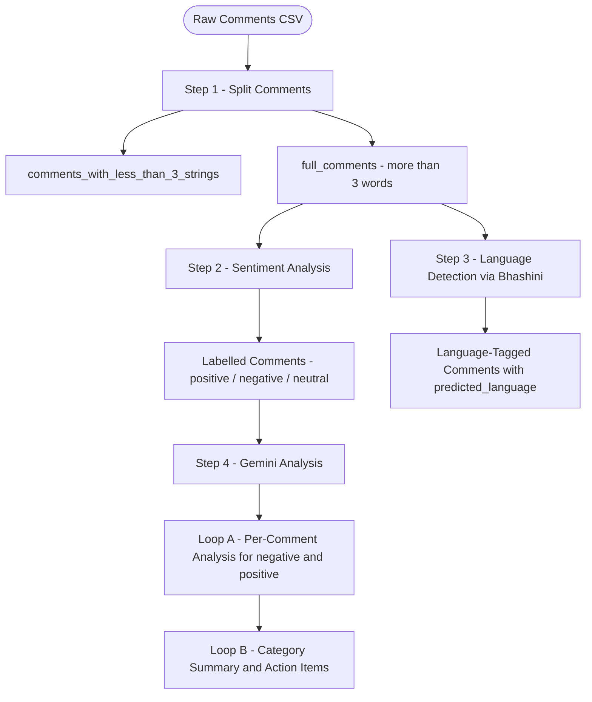
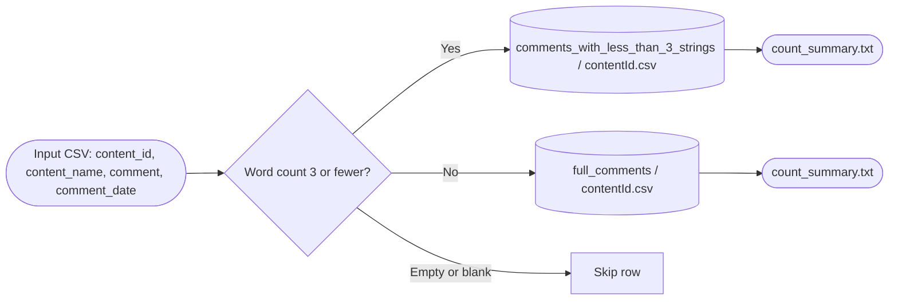
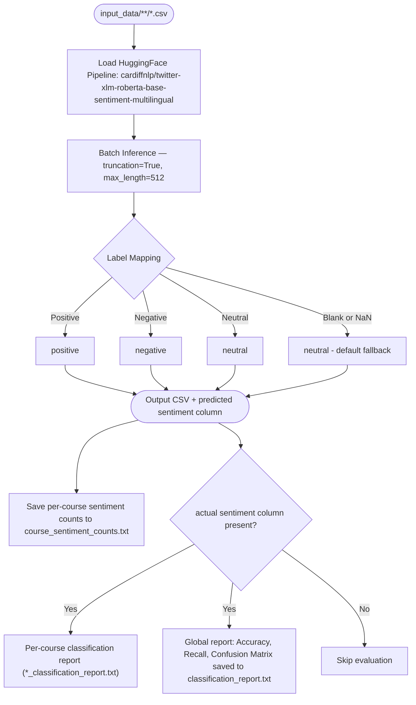
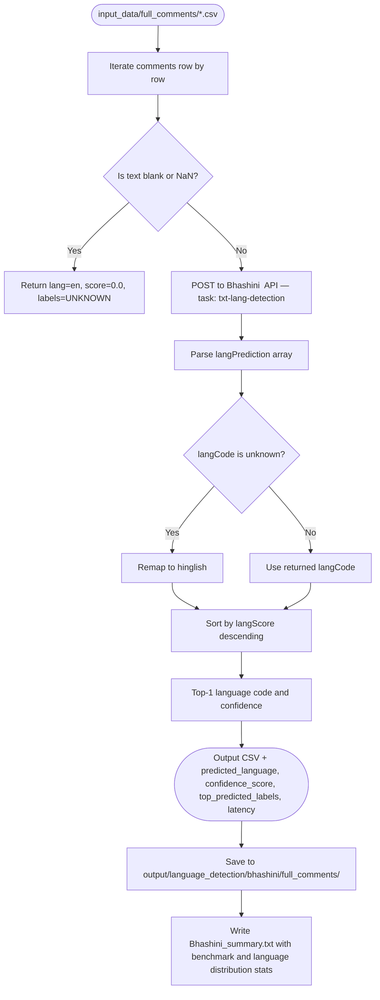
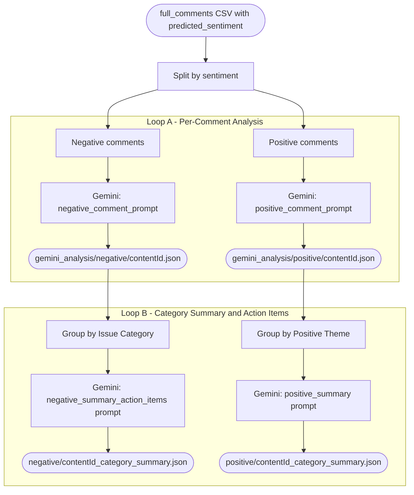
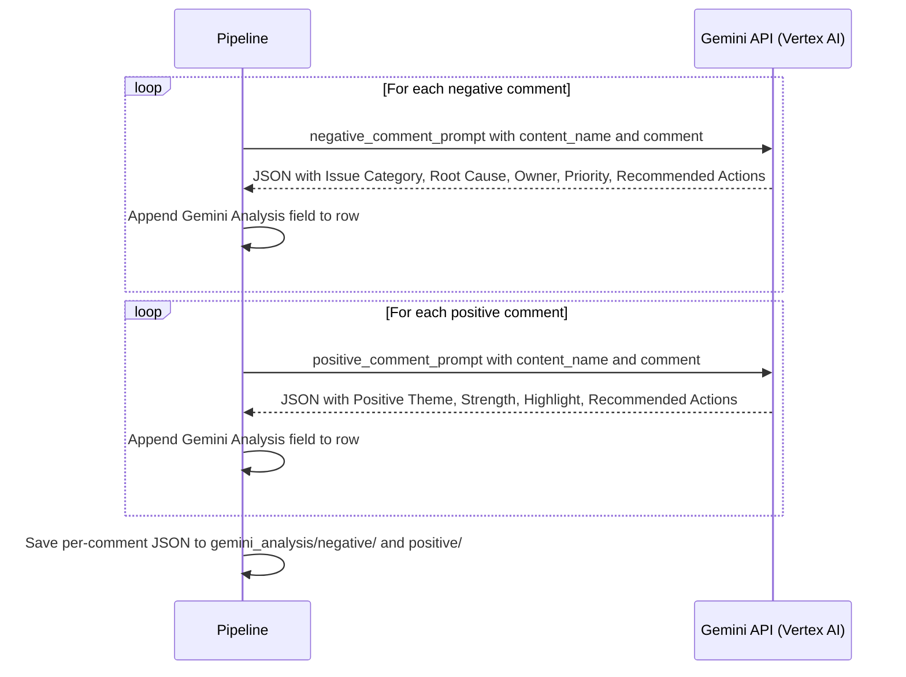
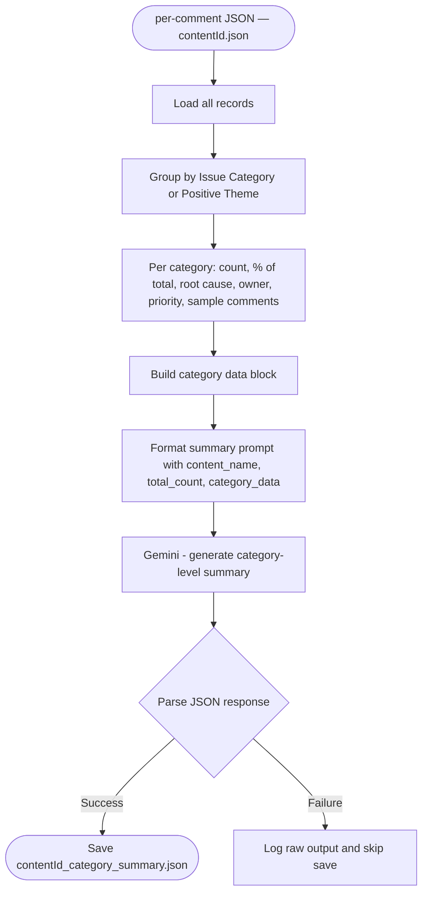
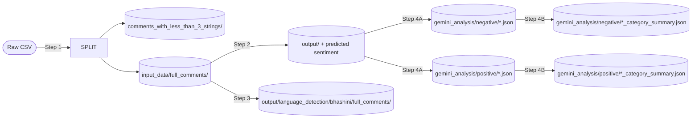

# Sentiment Analysis Pipeline — Detailed Documentation

## Overview

This document describes the end-to-end pipeline for analyzing learner comments on iGOT course content. The pipeline covers data splitting, sentiment classification, language detection, and deep Gemini-driven analysis with actionable summaries.

---

## High-Level Pipeline Flow

---

## Step 1 — Split Comments by Length

### What happens here

- The input CSV is read and grouped by `content_id`.
- For each content, a **separate output CSV** is written under both `comments_with_less_than_3_strings/` and `full_comments/`.
- The `comment_date` field is normalised to `YYYY-MM-DD` format (strips time component).
- Comments with zero tokens are silently skipped.
- A `count_summary.txt` is written into each output directory with per-file comment counts.

| Bucket | Condition | Use |
|---|---|---|
| `comments_with_less_than_3_strings/` | `word_count ≤ 3` | Archived; excluded from further analysis |
| `full_comments/` | `word_count > 3` | Fed into Steps 2, 3, and 4 |

---

## Step 2 — Sentiment Analysis

### Model details

| Property | Value |
|---|---|
| Model | `cardiffnlp/twitter-xlm-roberta-base-sentiment-multilingual` |
| Task | `sentiment-analysis` |
| Input truncation | `max_length = 512 tokens` |
| Output column | `predicted sentiment` (space-separated) |
| Output labels | `positive`, `negative`, `neutral` |
| Fallback for blank input | Replaced with `"neutral statement"` before inference |

### Outputs

| File | Description |
|---|---|
| `output/<rel_path>/contentId.csv` | Original CSV with appended `predicted sentiment` column |
| `output/course_sentiment_counts.txt` | Per-course positive / neutral / negative counts |
| `output/<rel_path>/contentId_classification_report.txt` | Per-course classification report (if ground-truth present) |
| `output/classification_report.txt` | Aggregated global report with accuracy, recall, and confusion matrix |

### Evaluation (when ground-truth `actual sentiment` column exists)

- Overall accuracy score
- Per-class recall
- Full classification report per course and globally
- Confusion matrix with label breakdown

---

## Step 3 — Language Detection (Bhashini )

### API details

| Property | Value |
|---|---|
| Endpoint | `https://meity-auth.contrib.org//apis/v0/model/compute` |
| Model ID | `631736990154d6459973318e` |
| Task type | `txt-lang-detection` |
| Auth | `BHASHINI_USER_ID` + `BHASHINI_AUTH_TOKEN` from `.env` |
| Timeout | 30 seconds per request |
| Error handling | Returns `ERROR / 0.0` on exception; processing continues |

### Fallback and remapping logic

| Condition | Behaviour |
|---|---|
| Blank or NaN text | `predicted_language = en`, `confidence_score = 0.0`, `top_predicted_labels = UNKNOWN` |
| No predictions returned | `predicted_language = en`, `confidence_score = 0.0`, `top_predicted_labels = UNKNOWN` |
| Bhashini returns `unknown` langCode | Remapped to `hinglish` |
| API / network error | `predicted_language = ERROR`, `confidence_score = 0.0` |

### Output fields appended per comment

| Field | Description |
|---|---|
| `predicted_language` | ISO code of the top language (or `hinglish` / `en` / `ERROR`) |
| `confidence_score` | Confidence of top prediction (0–1) |
| `top_predicted_labels` | Semicolon-separated `langCode:score` for all candidates |
| `latency` | Round-trip API time in seconds |

### Benchmark summary (`Bhashini_summary.txt`)

- Per-file: sample count and average latency
- Overall: total files, total samples, average latency, throughput (samples/sec)
- Language distribution: per-language count and percentage
- Separate counts for successful detections vs. failures (`ERROR`)

---

## Step 4 — Gemini Analysis (Two Loops)

---

### Loop A — Per-Comment Analysis

**Execution model:** Up to `MAX_WORKERS = 10` threads run concurrently via `ThreadPoolExecutor`. Already-processed comments are skipped on re-runs (resume support).

**Token tracking per call:**

| Counter | Source |
|---|---|
| `input` | `prompt_token_count` |
| `output` | `candidates_token_count` |
| `thinking` | `thoughts_token_count` |
| `total` | `total_token_count` |

---

### Loop B — Category Summary & Action Items

**What the summary captures:**

- Overall breakdown of issue categories (negative) or positive themes (positive)
- Per-category percentage contribution
- Consolidated root causes and owners
- Prioritised, actionable recommendations sourced from per-comment Gemini output
- Top representative sample comments per category

---

## End-to-End Data Flow

---

## Configuration Reference

| Parameter | Source | Description |
|---|---|---|
| `sentiment_model` | `.env` | HuggingFace model ID (default: `cardiffnlp/twitter-xlm-roberta-base-sentiment-multilingual`) |
| `BHASHINI_USER_ID` | `.env` | Bhashini  user ID |
| `BHASHINI_AUTH_TOKEN` | `.env` | Bhashini API auth token |
| `VERTEX_PROJECT_ID` | `.env` | GCP project for Vertex AI |
| `VERTEX_LOCATION` | `.env` | GCP region for Vertex AI |
| `GEMINI_MODEL` | `.env` | Gemini model name (default: `gemini-2.5-flash`) |
| `MAX_WORKERS` | Hardcoded | Thread pool size for parallel Gemini calls (default: `10`) |
