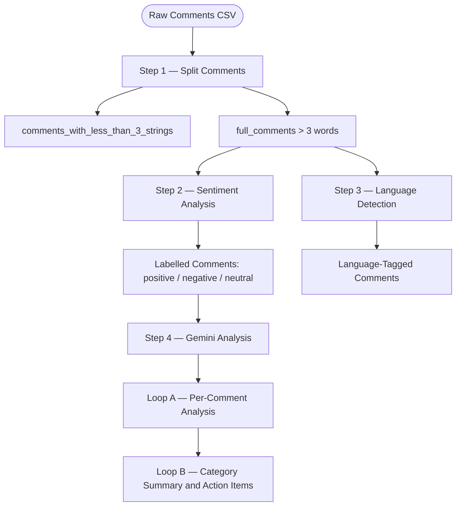

# iGOT Sentiment Analysis Pipeline

An end-to-end NLP pipeline that processes learner comments on iGOT course content to produce structured, actionable insights. The system classifies comment sentiment, detects the language of each comment, and uses Google Gemini on Vertex AI to perform deep per-comment categorisation and course-level summarisation with prioritised action items.

---

## Pipeline Overview



---

## Project Structure

```
.
├── clean_and_date_format.py              # Step 1: Split and normalise raw CSV
├── sentiment_analysis_with_confusion_matrix.py  # Step 2: XLM-RoBERTa inference
├── bhashini_lang_detect.py               # Step 3: Bhashini language detection
├── sarvam_lang_detect.py                 # Step 3 (alt): Sarvam AI language detection
├── gemini_analysis.py                    # Step 4: Gemini per-comment + summary analysis
├── generate_dashboard_bhashini.py        # Dashboard generation (Bhashini output)
├── generate_dashboard_sarvam.py          # Dashboard generation (Sarvam output)
├── generate_dashboard_top2.py            # Dashboard generation (top-2 courses)
├── top2_category_summary.py              # Category summary for top-2 courses
├── main.py                               # Entry point
├── pyproject.toml                        # Dependencies (uv / pip)
├── prompt/
│   ├── negative_comment_prompt.yaml
│   ├── positive_comment_prompt.yaml
│   ├── negative_sumamry_action_items.yaml
│   └── positive_summary.yaml
├── input_data/
│   ├── full_comments/                    # Per-course CSVs (> 3 words)
│   └── comments_with_less_than_3_strings/
├── output/
│   ├── full_comments/                    # Sentiment-tagged CSVs
│   ├── language_detection/               # Bhashini / Sarvam outputs
│   └── course_sentiment_counts.txt
└── gemini_analysis/
    ├── negative/                         # Per-comment negative JSON
    └── positive/                         # Per-comment positive JSON
```

---

## Setup

### Prerequisites

- Python 3.11+
- [`uv`](https://github.com/astral-sh/uv) (recommended) or `pip`
- Access to:
  - Google Vertex AI (Gemini)
  - Bhashini ULCA API and/or Sarvam AI API

### Install dependencies

```bash
uv sync
# or
pip install -e .
```

### Configure environment

Create a `.env` file in the project root:

```env
# Google Vertex AI
VERTEX_PROJECT_ID=your-gcp-project-id
VERTEX_LOCATION=us-central1
GEMINI_MODEL=gemini-2.5-flash

# Bhashini ULCA
BHASHINI_USER_ID=your-user-id
BHASHINI_AUTH_TOKEN=your-auth-token

# Sarvam AI (optional alternative)
SARVAM_API_SUBSCRIPTION_KEY=your-sarvam-key
```

---

## Usage

### Step 1 — Split comments by length

Reads the raw CSV, groups by `content_id`, normalises dates to `YYYY-MM-DD`, and separates short (≤ 3 words) from full comments.

```bash
python clean_and_date_format.py
```

**Input:** `top 10 course comments.csv`  
**Output:** `input_data/full_comments/<content_id>.csv`, `input_data/comments_with_less_than_3_strings/<content_id>.csv`

---

### Step 2 — Sentiment analysis

Runs multilingual sentiment classification using `cardiffnlp/twitter-xlm-roberta-base-sentiment-multilingual` (HuggingFace Transformers / XLM-RoBERTa).

```bash
python sentiment_analysis_with_confusion_matrix.py
```

**Input:** `input_data/**/*.csv`  
**Output:**
| File | Description |
|---|---|
| `output/<path>/<content_id>.csv` | Original CSV + `predicted sentiment` column |
| `output/course_sentiment_counts.txt` | Per-course positive / neutral / negative counts |
| `output/*_classification_report.txt` | Per-course precision, recall, F1 (if ground-truth present) |
| `output/classification_report.txt` | Aggregated global metrics and confusion matrix |

---

### Step 3 — Language detection

Detects the language of each comment via the Bhashini ULCA API (or Sarvam AI as an alternative).

```bash
# Bhashini
python bhashini_lang_detect.py

# Sarvam AI (alternative)
python sarvam_lang_detect.py
```

**Input:** `input_data/full_comments/*.csv`  
**Output:** `output/language_detection/bhashini/full_comments/<content_id>.csv` + `Bhashini_summary.txt`

| Field appended | Description |
|---|---|
| `predicted_language` | ISO language code (or `hinglish` / `en` / `ERROR`) |
| `confidence_score` | Confidence of top prediction (0–1) |
| `top_predicted_labels` | Semicolon-separated `langCode:score` candidates |
| `latency` | Round-trip API time in seconds |

---

### Step 4 — Gemini analysis

Runs two sequential passes over sentiment-tagged comments using Google Gemini on Vertex AI.

```bash
python gemini_analysis.py
```

**Loop A — Per-comment analysis** (up to 10 threads in parallel):
- Each negative comment → `negative_comment_prompt.yaml` → structured JSON with Issue Category, Root Cause, Owner, Priority, Recommended Actions
- Each positive comment → `positive_comment_prompt.yaml` → structured JSON with Positive Theme, Strength, Highlight

**Loop B — Category summary**:
- Groups per-comment outputs by Issue Category / Positive Theme
- Calls Gemini once per course per sentiment to produce a consolidated summary with prioritised action items

**Output:**
| Path | Description |
|---|---|
| `gemini_analysis/negative/<content_id>.json` | Per-comment negative analysis |
| `gemini_analysis/positive/<content_id>.json` | Per-comment positive analysis |
| `gemini_analysis/negative/<content_id>_category_summary.json` | Negative category summary |
| `gemini_analysis/positive/<content_id>_category_summary.json` | Positive theme summary |

> **Resume support:** Already-analysed comments are skipped on re-runs, making it safe to resume after partial failures.

---

## Prompt Templates

All prompts live in `prompt/` and are versioned inside each YAML file:

| File | Used in | Purpose |
|---|---|---|
| `negative_comment_prompt.yaml` | Loop A | Tag and classify each negative comment |
| `positive_comment_prompt.yaml` | Loop A | Tag and classify each positive comment |
| `negative_sumamry_action_items.yaml` | Loop B | Generate negative category summary with action items |
| `positive_summary.yaml` | Loop B | Generate positive theme summary |

---

## Models & APIs

| Component | Details |
|---|---|
| Sentiment model | `cardiffnlp/twitter-xlm-roberta-base-sentiment-multilingual` |
| Language detection | Bhashini ULCA `txt-lang-detection` (model ID `631736990154d6459973318e`) |
| Language detection (alt) | Sarvam AI `text.identify_language` |
| Gemini model | `gemini-2.5-flash` (configurable via `GEMINI_MODEL` env var) |
| Gemini platform | Google Vertex AI |

---

## Documentation

- [High-Level Design](high_level_documentation.md) — Architecture, component roles, data flow diagrams
- [Pipeline Documentation](pipeline_documentation.md) — Step-by-step flow with detailed Mermaid diagrams and output schemas
# Sentiment_analysis_comments
# Sentiment_analysis_comments
